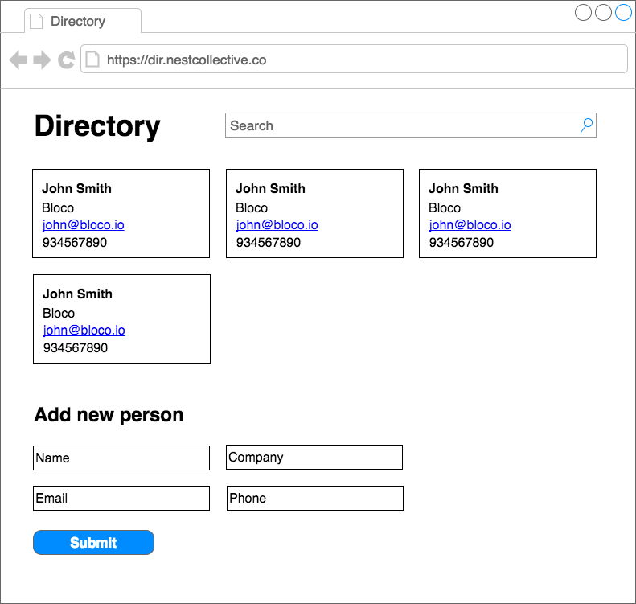

Summer Internship Challenge
===========================

Requirements
------------


### Install Git
```
# For linux users
$ sudo apt-get install git
```
Checkout this link to install Git on other platforms: [Install Git](https://git-scm.com/book/en/v1/Getting-Started-Installing-Git)


Clone the repository
--------------------

1. Ask one of the mentors to create a new fork of this repository for yourself with the name **nestsi17-[your name]**

2. Clone the repository on your personal computer
```
$ git clone git@github.com:pcioga/nestsi17-[your name].git
```


Challenge
---------

### 1. Build a static web page

Here's a simple wireframe of a Web Application where you can just add people to a directory.




1. Start by building a static web page, using only HTML and CSS, mirroring the mockup above. Don't get too much in detail, just keep the same structure.

Fell free to use any CSS frameworks like Bootstrap, Foundation or similar if you are familiar with any.


### 2. Build a dynamic web application

Now that the main components are in place, continue by making your application dynamic. Try to dinamically serve the contents displayed on the page from a database.

You are free to choose any kind of technologies you're familiar with to achieve this task, be it **Ruby on Rails**, **Sinatra**, **ExpressJS**, **Django**, or any other.
Also, use whatever database you're used to, be it relational such as **PostgreSQL** and **MySQL**, document based such as **MongoDB** or any other.

Bring in a new feature by adding people to the directory using the form at the end of the page.
> If you're unfamiliar with server-side web frameworks, try to use Javascript to implement the same functionality.

Extra:

Done already? You must be some kind of genius! Here are a couple of small challenges just to keep you occupied a little longer:

- Create validations for the form fields
- On the user card, make the email links fully functional (click to send an email)
- Make the search bar usefull by implementing user filtering
- Upload a user photo
- Click on the card to access a user profile page


Upload your work
----------------

When you're done, be sure to upload your work back to Github by committing directly to master or to any other branch of your choice.

Don't forget to include instructions on how to set up your web application so we can run it in our PCs.


Thank You
----------------

Thanks for spending the day with us and... Godspeed!
